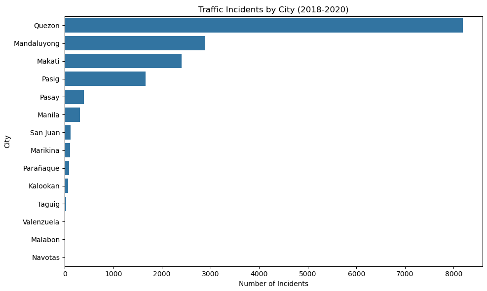
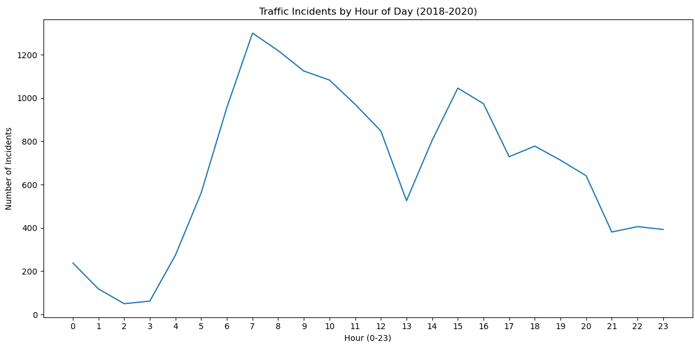
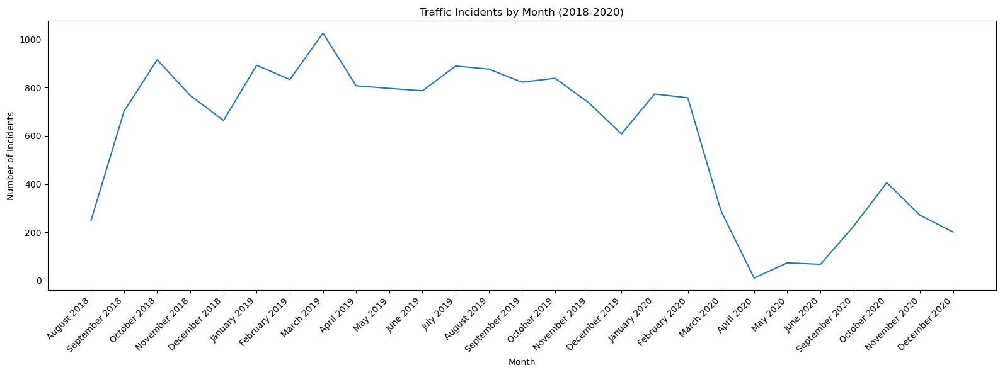
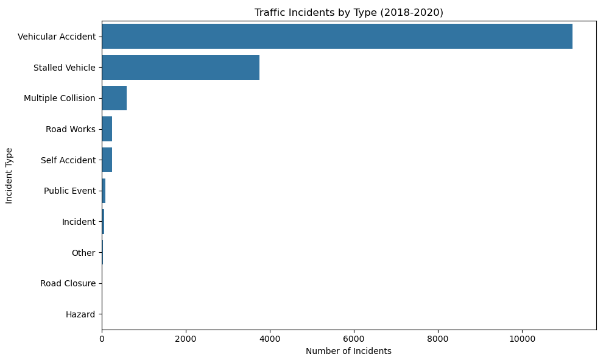
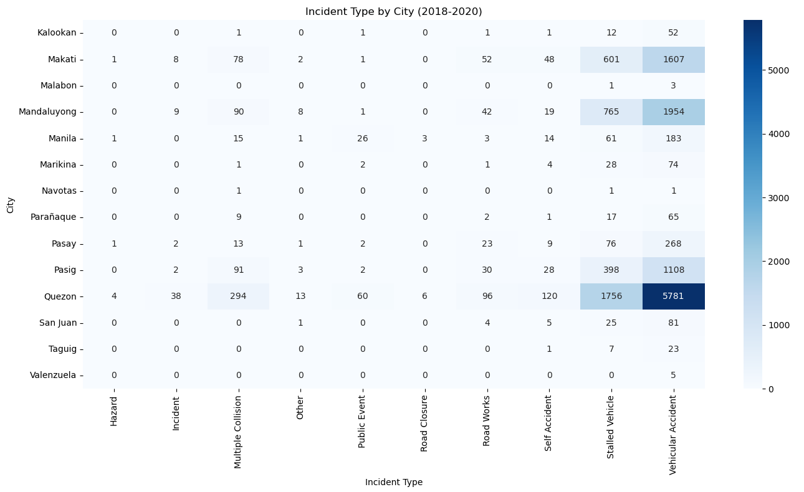

# MMDA Traffic Incident Analysis (2018–2020)

An exploratory data analysis of traffic incident reports logged by the Metropolitan Manila Development Authority (MMDA) across Metro Manila from August 2018 to December 2020. This project covers data cleaning, feature engineering, and visualization using Python.

---

## Technologies

- Python 3
- Pandas
- Seaborn
- Jupyter Notebook

---

## Features

- Cleans and standardizes ~17,000 raw incident records from Kaggle
- Engineers new columns: "Month", "Hour", and "Type_Category" from raw fields
- Handles encoding issues, inconsistent city names, and 493 messy incident type values
- Visualizes incident patterns across time, location, type, and road direction
- Cross-analysis: incident type by city, peak hours by type, monthly trends by type

---

## The Process

1. **Data Cleaning** — Dropped irrelevant columns (Tweet, Source), filtered low-accuracy entries, fixed encoding errors, standardized city names, handled nulls, and categorized 493 raw incident type values into 10 clean categories.
2. **Feature Engineering** — Extracted `Month` (ex. August 2018) from the Date column and `Hour` (ex. 0–23) from the Time column. Created `Type_Category` to group messy incident descriptions into usable labels.
3. **EDA** — Analyzed incident distribution by city, hour, month, type, direction, and average lanes blocked.
4. **Visualization** — Plotted findings using Seaborn bar charts, line charts, and a heatmap.

---

## Key Findings

- **Quezon City being the hotspot** — 8,200+ incidents, nearly 3x more than Mandaluyong in second place, and leading in every incident category.
- **7 AM is the most dangerous hour** — incidents peak sharply at 7 AM driven almost entirely by vehicular accidents, with a secondary peak at 3 PM.
- **COVID-19 caused a near-total halt in incidents** — monthly incidents averaged 800–1,000 through early 2020, then collapsed to near zero in April 2020 during the ECQ lockdown.
- **Vehicular accidents dominate** — over 11,000 of ~16,000 incidents were vehicular accidents. All other categories combined are less than 10%.
- **Multiple collisions are rare but disproportionately disruptive** — they average 1.45 lanes blocked per incident, the highest of any category.
- **North and Southbound roads bear the heaviest load** — NB and SB combined account for over 70% of all directional incidents, consistent with EDSA's north-south orientation.

---

## What I Learned

- Real-world datasets are messy in ways tutorials don't prepare you for. 493 unique incident type values caused by typos, inconsistent formatting, and encoding errors required a custom categorization function to resolve.
- Domain knowledge matters. My background in traffic planning helped me contextualize findings particularly why the 7 AM spike makes sense, why northbound and southbound dominate, and make better decisions during cleaning.
- The COVID-19 lockdown shows up clearly in the data without any additional context. A reminder that external events leave measurable traces in datasets.

---

## How It Can Be Improved

- Add geospatial analysis using the Latitude and Longitude columns to map incident hotspots
- Build an interactive dashboard using Tableau or Power BI
- Expand the `Type_Category` classification to reduce entries falling into `Other`
- Cross-reference with weather or holiday data to identify additional patterns

---

## Preview

### Incidents by City

### Incidents by Hour

### Monthly Trend

### Incident Type Distribution

### Incident Type by City Heatmap

---

*Dataset source: https://www.kaggle.com/datasets/esparko/mmda-traffic-incident-data
